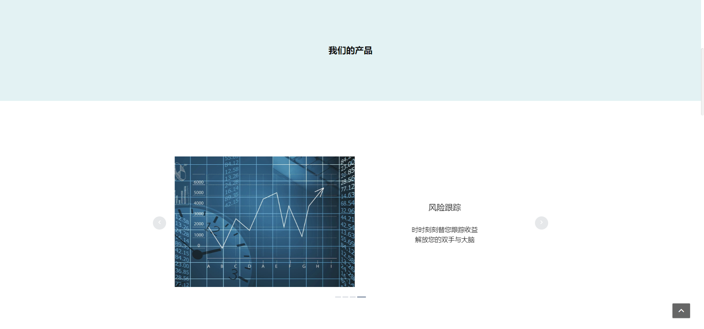
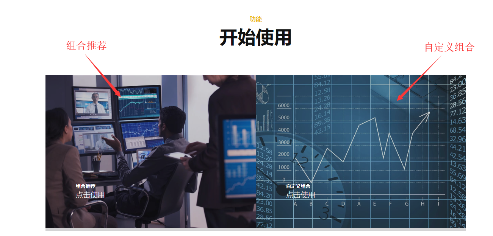
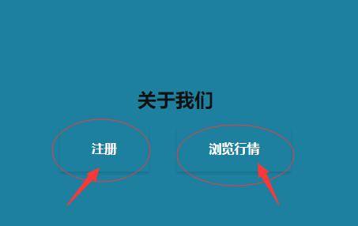
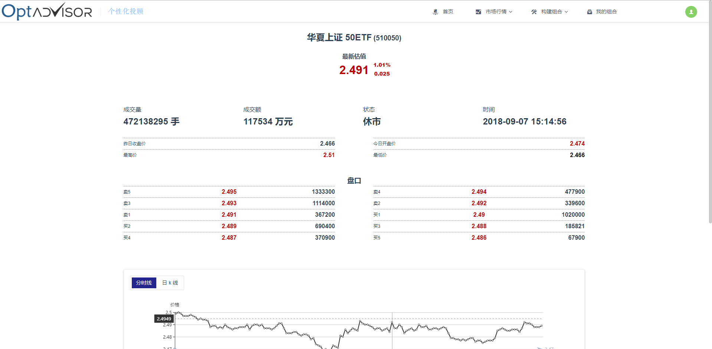
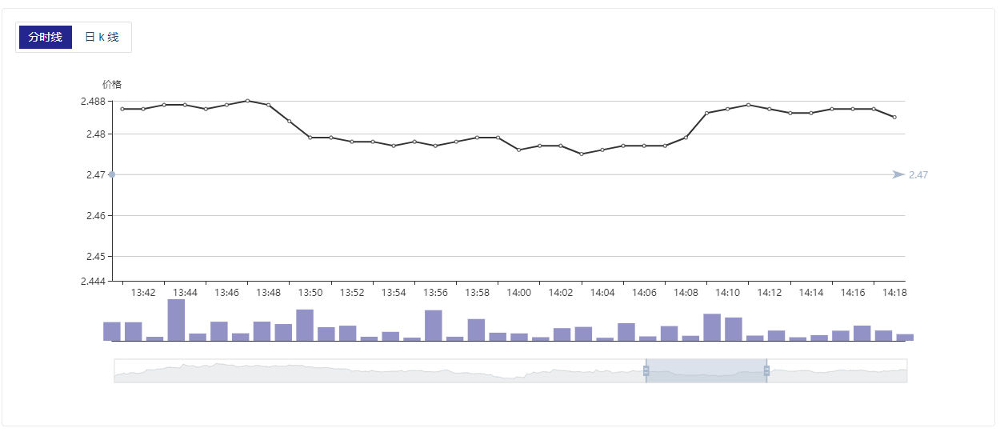
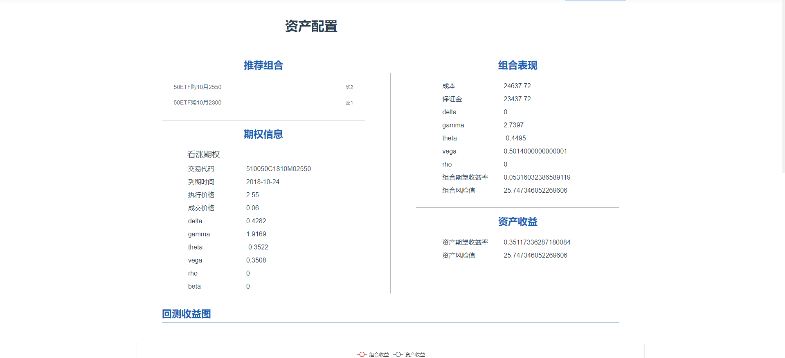
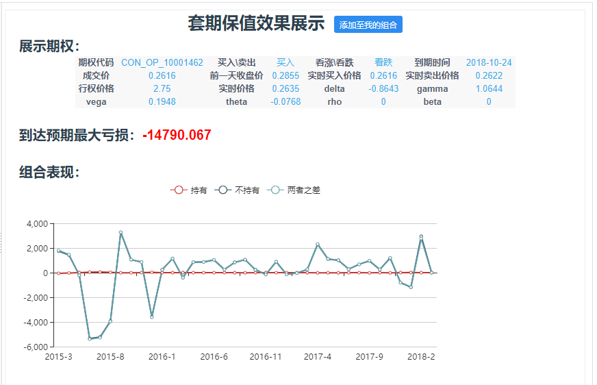
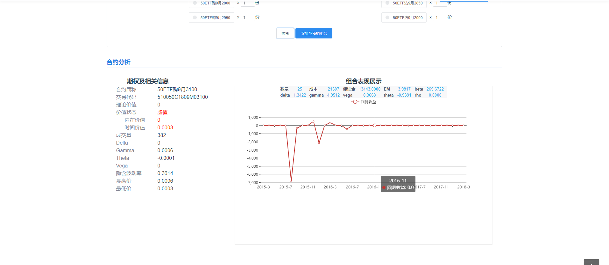
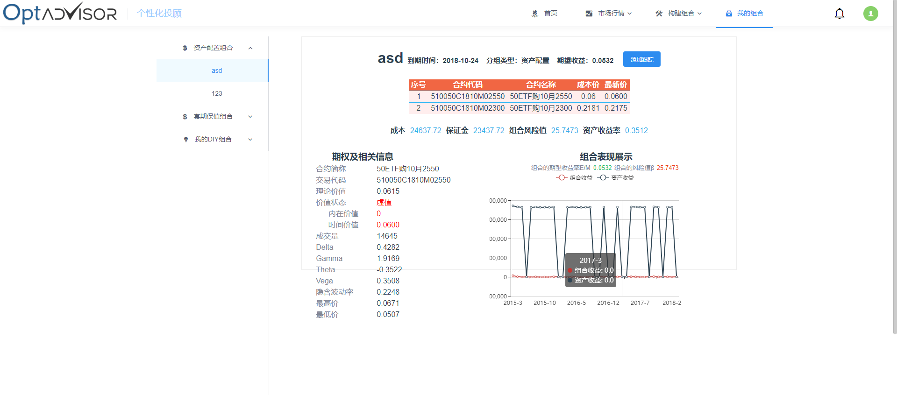

### 用户手册

1. [首页](#首页)
   - [注册](#注册)
   - [登陆](#登陆)
   - [忘记密码](#忘记密码)
2. [市场行情](#市场行情)
   - [50ETF](#50ETF)
   - [50ETF期权](#50ETF期权)
   - [行情图](#行情图)
3. [构建组合](#构建组合)
   - [资产配置](#资产配置)
   - [套期保值](#套期保值)
   - [DIY组合构建](#DIY组合构建)
4. [我的组合](#我的组合)
5. [消息界面](#消息界面)
6. [个人信息](#个人信息)

#### 首页

​	首页展示了本投顾系统的主要功能及特点。

​	进入网站首页，如图1，点击`了解更多`按钮或 滚动鼠标滚轮 可看到产品介绍轮播图（图2）。

​											图1

​											图2

点击图3中的`注册`按钮，或者 *未登录状态下* 点击 图4中的功能按钮，图5中的注册按钮，进入[注册](#注册)界面

										

​											   图3

​											图4

​											图5

*登录状态下* 点击图4中`组合推荐`按钮，进入[资产配置](#资产配置)界面，点击`自定义组合`按钮，进入[DIY组合构建](#DIY组合构建)界面。

点击图5中`浏览行情`按钮进入市场行情——[50ETF](#50ETF)界面

点击首页右上角的`登陆`按钮进入[登陆](#登陆)界面，如图6。 

​											图6

点击右下角`^`按钮，可回到页面顶部，如图7

​											图7

#### 注册

注册界面如图8，

​										         图8

按提示填写注册信息后，点击`下一步`按钮，填写风险评估问卷，如图9。

​											图9

问卷填写后，点击`下一步`完成注册，查看风险评估结果，如图10

​											图10

在风险评估结果页面（如图10），点击`快速进入Optadvisor`按钮，进入[50ETF](#50ETF)市场行情界面

#### 登陆

登陆界面如图11

​											图11

输入用户名，密码后（用户名密码通过[注册](#注册)获得)，点击`登陆`按钮，成功登陆后，进入[50ETF](#50ETF)市场行情页面

登陆失败后，可在页面上部，看到错误信息（用户名不存在，密码错误...），如图12。

​											图12

点击`注册`按钮，进入[注册](#注册)页面

点击`忘记密码`按钮，进入[忘记密码](#忘记密码)页面

#### 忘记密码

忘记密码页面如图13，

​											图13

按照提示填写信息后，点击`获取验证码`按钮，系统会向该用户[注册](#注册)时填写的手机，发送验证码。正确填写验证码后，点击出现的`修改密码`按钮，密码更新，如图14

​											图14

#### 市场行情

市场行情包括[50ETF](#50ETF)行情和[50ETF期权](#50ETF期权)行情

#### 50ETF

50ETF行情界面如图15

​											图15

#### 行情图

行情图表分为 **分时线** 和 **日k线**，按钮可在两张图表之间切换。

图表从上到下分为价格折线图，成交量柱状图，选中的时段三个部分

鼠标悬浮在折线图区域或者成交量区域，可看到对应位置的行情信息，如图16

​											图16

在折线图区域，成交量区域或者时段选择区域滚动鼠标滚轮，可以缩放图表，如图17

​											图17

在时段选择区域，可以按住鼠标左键拖动，改变观察时段。

日k线显示行情时，点击下方图例，可隐藏或显示对应的曲线，如图18。

​											图18

#### 构建组合

构建组合是本系统提供的核心服务，包括[资产配置](#资产配置)，[套期保值](#套期保值)，[DIY组合构建](#DIY组合构建)三个部分。

#### 资产配置

资产配置页面如图19

​											图19

页面左侧，市场预期部分提供八个选项，个人根据对未来50ETF价格和波动率的预期，点击选择对应的选项，如图19，选择了（上涨，增加）选项。

预期偏好选择后，在页面右侧根据提示填写本金，允许最大损失比例，选择价格有效时间，并拖动滑块或点击进度条任意位置以选择对应的预期价格和预期波动率。

选择完成后，点击下一步按钮，等待系统计算并查看推荐组合。推荐组合界面如图20。

​											图20

可在页面右下角，点击`加入我的组合`按钮，并且输入组合命名后，可成功加入我的组合，并且跳转到[我的组合](#我的组合)页面。

#### 套期保值

套期保值界面如图21

​											图21

在左侧按提示输入持仓量，套保比例和预测价格最低值，选择套保期限后，右侧出现套期保值效果展示，如图22

​											图22

点击`添加至我的组合`按钮，并且输入组合命名后，可成功加入我的组合，并且跳转到[我的组合](#我的组合)页面。

#### DIY组合构建

DIY组合构建，用户可选择现有期权进行组合，并查看组合的相关属性，页面如图23。

​											图23

1. 在日期选择框选择期权日期，查看相应日期的期权列表
2. 勾选当前列表中的期权，并且在下方“已选择的组合”选择期权份数，负数为卖出，正数为买入，如图25
3. 点击某个期权，以在下方合约分析栏查看期权相关信息，如图25

​											图24

​											图25

在选择组合后，点击`预览`按钮，查看选择的组合表现，如图26，

​											图26

点击`添加至我的组合`按钮，并输入组合名称后，可成功添加至我的组合，并且跳转至[我的组合](#我的组合)界面。

#### 我的组合

我的组合界面如图27，页面左侧是不同添加来源的组合，鼠标左键点击单个组合，可在页面右侧查看该组合详细信息。

​											图27

鼠标右键点击单个组合，可对组合进行管理。如图28

​											图28

在组合详细信息界面中，点击`添加跟踪`按钮，可持续跟踪组合收益情况，在亏损过多时通过[消息界面](#消息界面)自动提示。

#### 消息界面

消息界面如图29

​											图29

#### 个人信息

点击导航右上方头像按钮，可进入个人信息页面，如图30

​											图30

在个人信息界面，修改信息后点击`保存`按钮，可修改个人信息

点击`修改密码`按钮，并根据提示输入原密码和新密码后，点击`保存`按钮，可以修改密码，如图31.

​											图31

