### User Manual

1. [Home](#Home)
   - [Register](#Register)
   - [Login](#Login)
   - [Forget Password](#Forget Password)
2. [Market](#Market)
   - [50ETF](#50ETF)
   - [50ETF Option](#50ETF Option)
   - [Option chart](#Option chart)
3. [Construct Portfolio](#Construct Portfolio)
   - [Allocation](#Allocation)
   - [Hedging](#Hedging)
   - [DIY](#DIY)
4. [MyPortfolio](#MyPortfolio)
5. [Prompt](#Prompt)
6. [Profile](#Profile)

#### Home

	The home page shows the main functions and features of this investment system.

	Go to the home page of the website, as shown in Figure 1. Click on the `了解更多`button or scroll the mouse wheel to see the product introduction carousel (Figure 2).

										Figure 1

										Figure 2

Click the `注册` button in Figure 3, or *Unregistered status* Click the function button in Figure 4 or the registration button in Figure 5, and enter the [Register](#Register) screen.

										

											   Figure3

											Figure4

											Figure5

*Login status* Click the`组合推荐`button in Fugure 4 to enter the  [allocation](#allocation) page，click `自定义组合 ` button in Figure 4 to enter [DIY](#DIY) page。
Login status click the `组合推荐` button in Figure 4 to enter the [allocation](#allocation) page, click the `自定义组合`button to enter the  [DIY](#DIY) page。

click the `浏览行情` button to enter the [50ETF](#50ETF) page.

Click the `登陆` in the upper right corner of the [Home](#Home) page to enter the [Login](#Login) page, as shown in Figure 6. 

											Figure6

Click the` ^` button in the lower right corner to return to the top of the page, as shown in Figure 7.

											Figure7

#### Register

Register page is as shown in Figure 8.

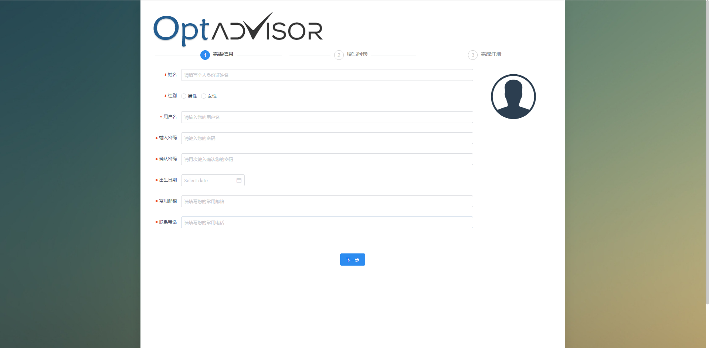

										         Figure8

After filling in the registration information as prompted, click the `下一步` button to fill out the risk assessment questionnaire, as shown in Figure 9.

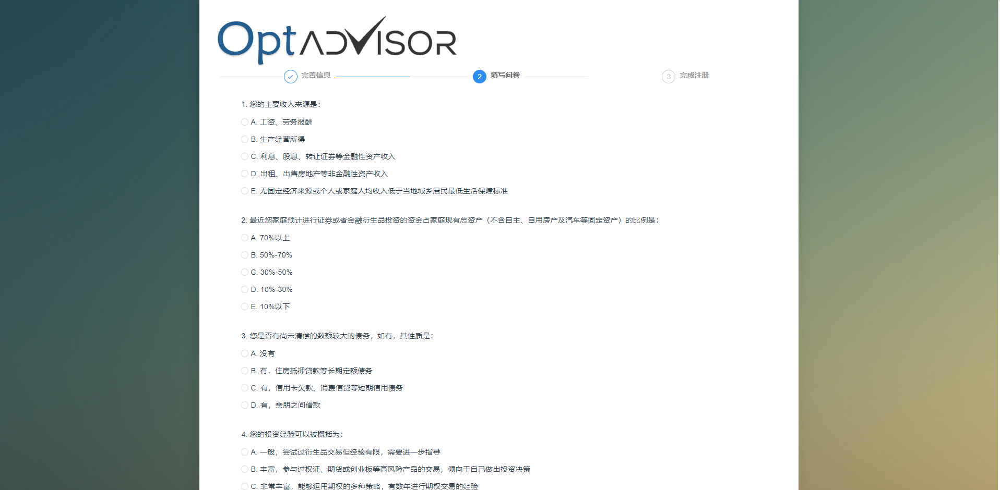

											Figure9

After completing the questionnaire, click `下一步` button to complete the registration and view the risk assessment results, as shown in Figure 10.

											Figure10

On the risk assessment results page (Figure 10), click on the `快速进入Optadvisor` button to enter the [50ETF](#50ETF) Market Quotes page.

#### Login

Login page is as shown as Figure 11.

											Figure11

Enter the user name, password (user name and password obtained by [Registration](#Registration)), click the `登陆`button, after successful login, enter the [50ETF](#50ETF)market quote page.

After the login fails, you can see the error message at the top of the page (the username does not exist, the password is incorrect...), as shown in Figure 12.

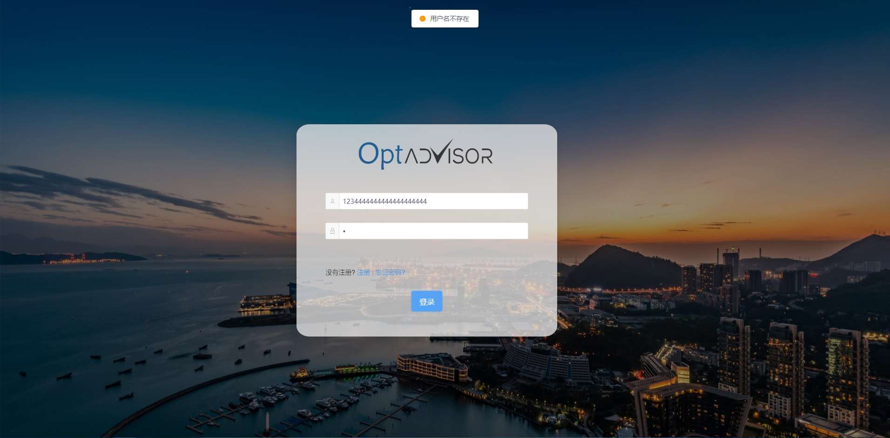

											Figure12

Click the `注册`button to enter the [Registration ](#Registration )page.

Click the `忘记密码` button to enter the [Forgot Password](#Forgot Password) page.

#### Forget Password

Foreget Password page is as shown in Figure 13，

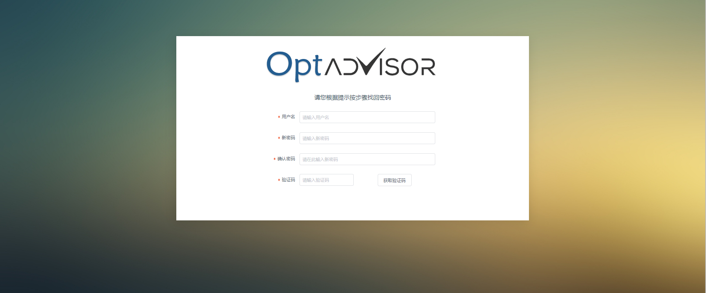

											Figure13

After filling in the information as prompted, click the `获取验证码` button, the system will send the verification code to the mobile phone that was filled in when the user registered. After filling in the verification code correctly, click the `修改密码` button that appears, and the password is updated, as shown in Figure 14.

											Figure14

#### Market

Market contains [50ETF](#50ETF) and [50ETF Option](#50ETF Option)

#### 50ETF

50ETF page is as shown as Figure 15

											Figure15

#### Option chart

Option chart contain **Time share chart ** 和 **K Chart**，button can switch between two charts。

The chart is divided into a price line chart from top to bottom, a bar chart of volume, and three parts of the Time Zoom.

The mouse is hovering in the line chart area or the volume area, and you can see the market information of the corresponding position, as shown in Figure 16.

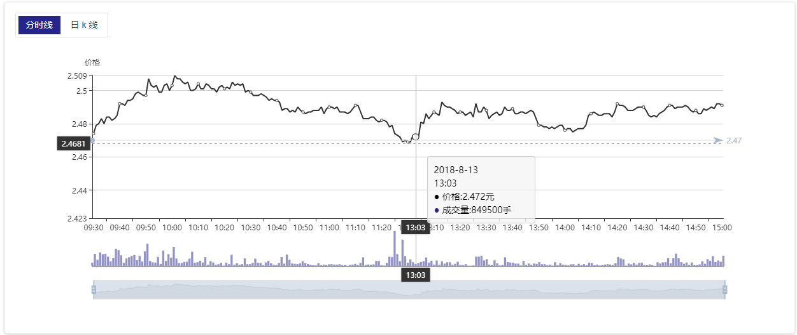

											Figure16

In the line chart area, the volume area or the Time Zoom area, scroll the mouse wheel to zoom the chart, as shown in Figure 17.

											Figure17

In the time period selection area, you can hold down the left mouse button and drag to change the observation period.

In  K Line Chart, click on the legend below to hide or display the corresponding curve, as shown in Figure 18.

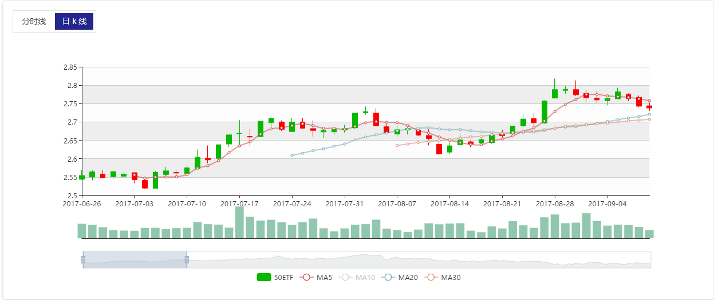

											Figure18

#### Construct Portfolio

Construct Portfolio is the core service provided by the system.，which contains [Allocation](#Allocation), [Hedging](#Hedging), [DIY](#DIY).

#### Allocation

Allocation page is as shown in Figure 19.

											Figure19

On the left side of the page, the market expects to provide eight options. based on the expectations of future  50ETF price and volatility,  Individuals can click to select the corresponding option, as shown in Figure 19, select the (up, increase) option.

After the preference is selected, fill in the principal according to the prompt on the right side of the page, allow the maximum loss ratio, select the price effective time, and drag the slider or click anywhere on the progress bar to select the corresponding expected price and expected volatility.

When the selection is complete, click the `下一步`button and wait for the system to calculate and view the recommended combination. The recommended combination interface is shown in Figure 20.

											Figure20

In the bottom right corner of the page, click the `添加至我的组合` button, and after the input the name of the combination ，it is successfully added to your portfolio，then direct to [MyPortfolio](#MyPortfolio) page.

#### Hedging

The hedging page is as shown in Figure 21

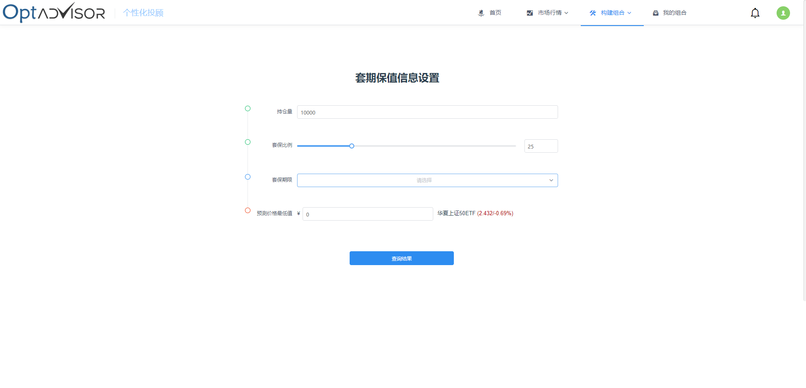

											Figure21

On the left side, enter the amount of positions, the ratio of the hedging and the lowest value of the forecast price. After selecting the hedging period, the hedging effect will appear on the right side, as shown in Figure 22.

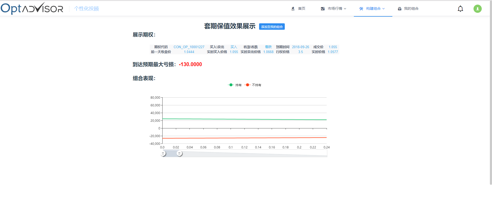

											Figure22

Click on the `添加至我的组合` button and enter the portfolio name to successfully add to yours portfolio and jump to my combination page.

#### DIY

In DIY page,  user can select existing options to combine and view the related attributes of the combination, as shown in Figure 23.

											Figure23

1. Select the option date in the date selection box to see the list of options for the corresponding date
2. Check the option in the current list, and select the number of options in the "Selected combination" below, the negative number is the sell, the positive number is the buy, as shown in Figure 25.
3. Click on an option to view option related information in the contract analysis bar below, as shown in Figure 25.

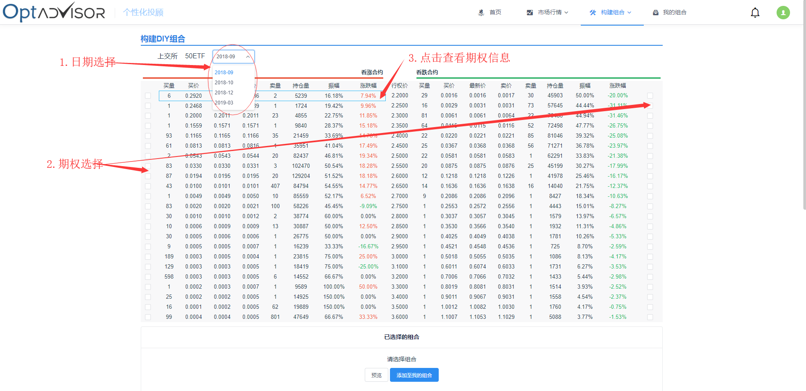

											Figure24

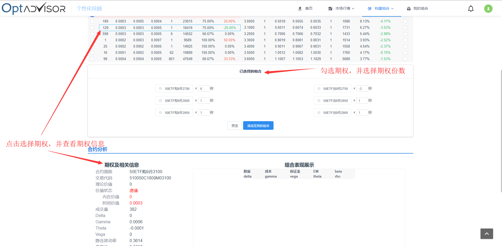

											Figure25

After selecting the combination, click the `预览` button to view the selected combination performance, as shown in Figure 26.

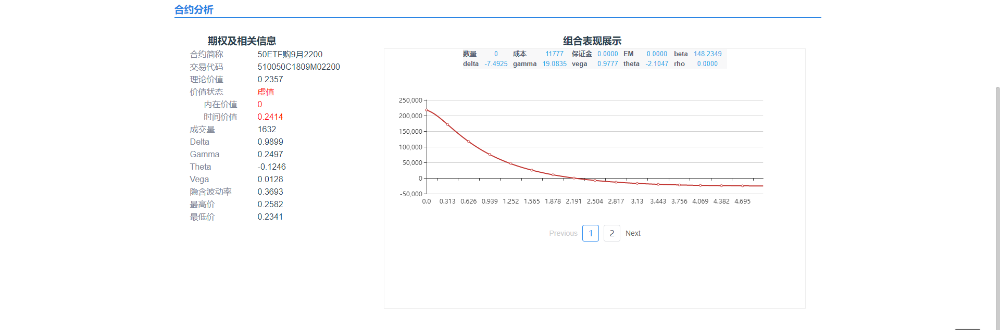

											Figure26

点击`添加至我的组合`按钮，并输入组合名称后，可成功添加至我的组合，并且跳转至[我的组合](#我的组合)界面。

Click the `添加至我的组合` button and  after enter the portfolio name, it can be  added to your portfolio and turn to [MyPortfolio](#MyPortfolio) page.

#### My Portfolio

My Portfolio page is as shown in Figure27，the left side of the page is a combination of different added sources. Click the single combination with the left mouse button to view the combination details on the right side of the page.

											Figure27

The combination can be managed by right-clicking on a single portfolio. Figure 28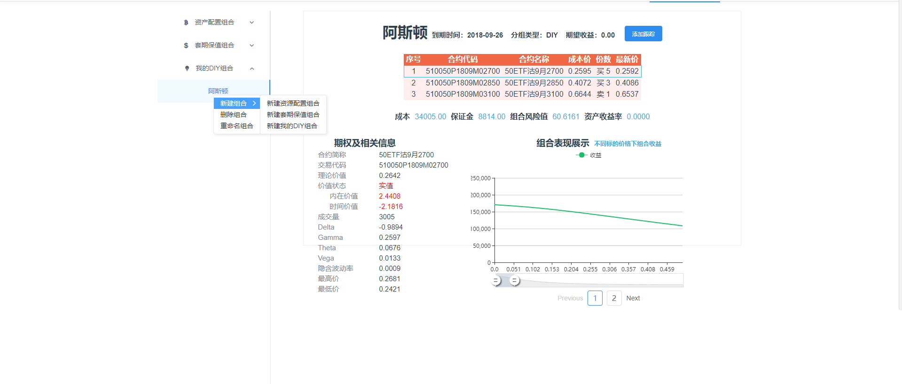

											Figure28

在组合详细信息界面中，点击`添加跟踪`按钮，可持续跟踪组合收益情况，在亏损过多时通过[消息界面](#消息界面)自动提示。

In the portfolio details page, click the `添加跟踪` button to continuously track the combined revenue status and automatically prompt through the message interface when there is too much loss.

#### Prompt

Prompt page is as shown in Figure 29

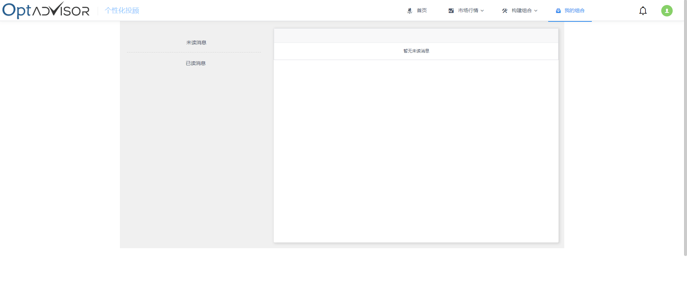

											Figure29

#### Profile

Click the avatar button at the top right of the navigation to enter the personal information page, as shown in Figure 30.

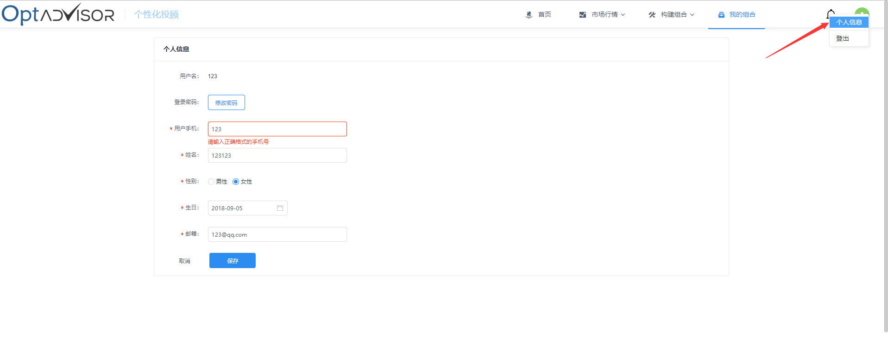

											Figure30

In the personal information interface, modify the information and click the save button to modify the personal information.

Click the`修改密码`button and enter the original password and new password as prompted. Click the `保存`button to change the password, as shown in Figure 31.

											Figure31

